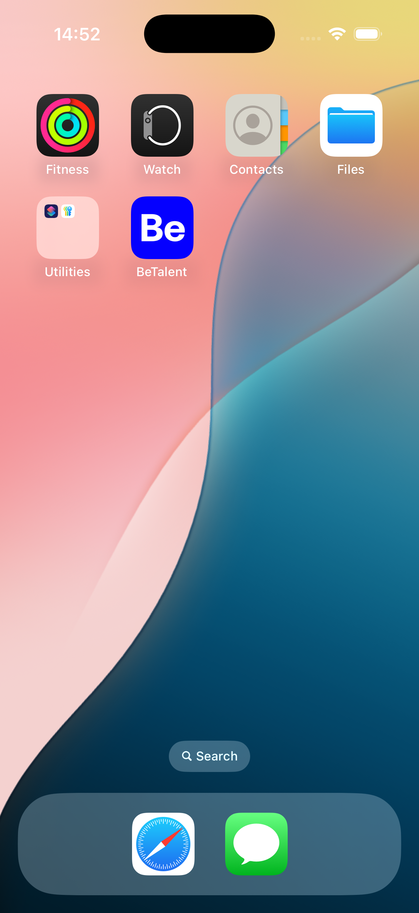
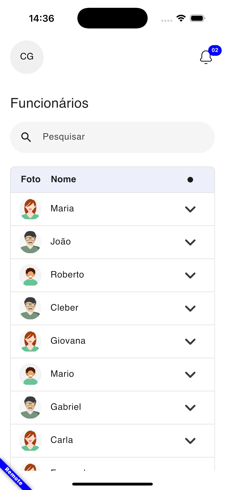
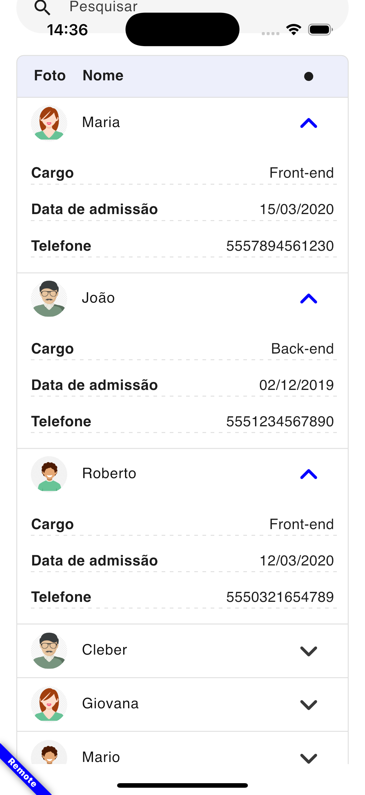

# BeTalent

Embora o visual e o código do projeto já possam oferecer uma boa perspectiva, é importante dedicar um momento para refletir sobre os acontecimentos durante o desenvolvimento. Isso permitirá uma compreensão mais ampla do processo.

Em primeiro lugar, não foquei tanto na interface, que certamente poderia ser mais refinada. Meu principal objetivo foi priorizar a funcionalidade, e mesmo assim não consegui implementar tudo o que havia planejado. A ideia inicial era realizar uma pesquisa semântica localmente, mas, apesar de ter sido uma experiência interessante, os resultados não foram satisfatórios. Cheguei a considerar o uso da API do Google para esse propósito, mas ao avaliar a complexidade envolvida, decidi seguir por um caminho mais simples, que resultou no modelo de pesquisa atual.

Gostaria de destacar que meu objetivo principal é sempre explorar coisas novas. Independentemente dos resultados das avaliações, o aprendizado adquirido ao longo do teste é lucro para mim.

## Uma visão geral da interface

    
    
    
    

## Coisas legais para se observar

- **DataSource**: O Bloc que controla a HomePage em algum nível usa um DataSource que pode ser remoto ou um mock local. Isso permite que a interface seja testada sem a necessidade de uma conexão com o servidor.

- **Arquitetura**: Um MVC. Precisa de um Clean Architecture? Jamais, quem gosta de overengineering é vampiro (brincadeira, eu gosto)

- **Cache**: O cache é feito de forma simples, mas eficaz. A maioria das rotas GET é armazenada em cache, e o cache é temporário.

- **Fastlane**: Desculpem a decepção, mas fiquei sem minutos para usar o gitactions, então deixei o setup inicial mesmo.
